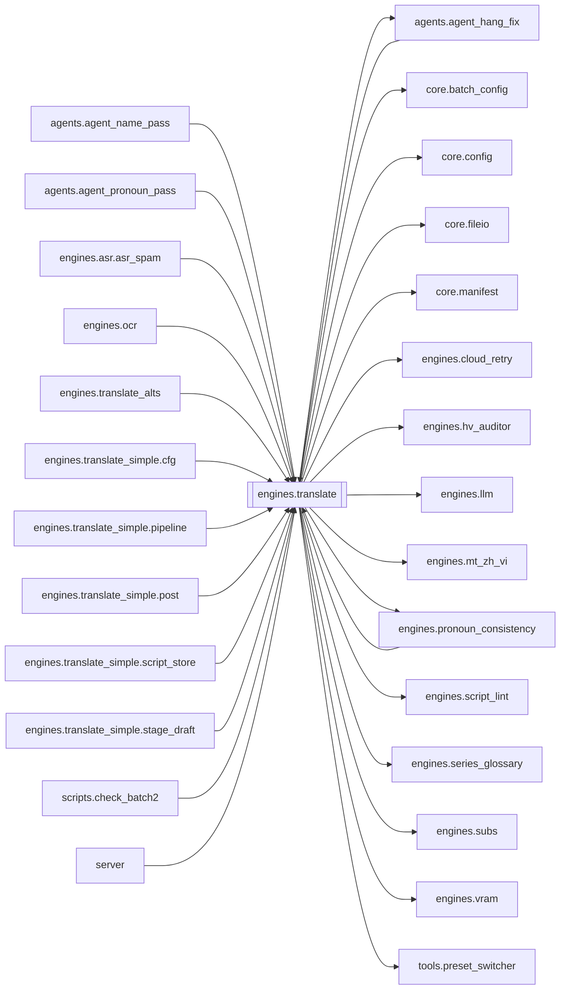

# `engines.translate`

[← Index](../generated/module-index.md) · [Brain home](../README.md)

<!-- AUTO:START — sinh bởi scripts/brain_build.py 2026-11-17 19:05. Đừng sửa tay khối này. -->
**File:** `engines/translate.py` · **Lớp:** `translate` · **5172 dòng** (4593 code) · **104 hàm**, **1 class** · sha1 `9a0ef185e0`

> translate.py — STAGE dịch: "lập phương án" (hồ sơ nhân vật + XƯNG HÔ) rồi dịch CÓ NGỮ CẢNH, khớp độ dài. Nâng cấp so với bản cũ:

### Phụ thuộc

- **Gọi tới (import nội bộ):** [agents.agent_hang_fix](./agents.agent_hang_fix.md), [core.batch_config](./core.batch_config.md), [core.config](./core.config.md), [core.fileio](./core.fileio.md), [core.manifest](./core.manifest.md), [engines.cloud_retry](./engines.cloud_retry.md), [engines.hv_auditor](./engines.hv_auditor.md), [engines.llm](./engines.llm.md), [engines.mt_zh_vi](./engines.mt_zh_vi.md), [engines.pronoun_consistency](./engines.pronoun_consistency.md), [engines.script_lint](./engines.script_lint.md), [engines.series_glossary](./engines.series_glossary.md), [engines.subs](./engines.subs.md), [engines.vram](./engines.vram.md), [tools.preset_switcher](./tools.preset_switcher.md)
- **Được dùng bởi:** [agents.agent_hang_fix](./agents.agent_hang_fix.md), [agents.agent_name_pass](./agents.agent_name_pass.md), [agents.agent_pronoun_pass](./agents.agent_pronoun_pass.md), [engines.asr.asr_spam](./engines.asr.asr_spam.md), [engines.ocr](./engines.ocr.md), [engines.pronoun_consistency](./engines.pronoun_consistency.md), [engines.translate_alts](./engines.translate_alts.md), [engines.translate_simple.cfg](./engines.translate_simple.cfg.md), [engines.translate_simple.pipeline](./engines.translate_simple.pipeline.md), [engines.translate_simple.post](./engines.translate_simple.post.md), [engines.translate_simple.script_store](./engines.translate_simple.script_store.md), [engines.translate_simple.stage_draft](./engines.translate_simple.stage_draft.md), [scripts.check_batch2](./scripts.check_batch2.md), [server](./server.md)
- **Được nhắc tên file `.py` (subprocess/script) bởi:** [engines.cloud_retry](./engines.cloud_retry.md), [restart_server](./restart_server.md), [scripts.check_batch2](./scripts.check_batch2.md), [server](./server.md)
- **Test:** `tests/test_layout_paths.py`, `tests/test_optimize_b5_b6.py`, `tests/test_pronoun_postpass.py`, `tests/test_pronoun_qa_slim_plan.py`, `tests/test_review_fail_not_rv.py`, `tests/test_review_parallel_workers.py`, `tests/test_review_pass1_upload.py`, `tests/test_simple_junk_park.py`, `tests/test_simple_r1_bugs.py`, `tests/test_translate_b1.py`, `tests/test_translate_b1_scenarios.py`, `tests/test_translate_b2.py`, `tests/test_translate_b2_review.py`, `tests/test_translate_b3.py`, `tests/test_translate_missing.py`, `tests/test_translate_simple.py`, `tests/test_translate_simple_next.py`, `tests/test_translate_simple_next_review.py`, `tests/test_translate_simple_scenarios.py`
- **Thư viện ngoài:** `context_studio`, `requests`, `translate_simple`

```mermaid
flowchart LR
  engines_translate[[engines.translate]]
  agents_agent_hang_fix[agents.agent_hang_fix] --> engines_translate
  agents_agent_name_pass[agents.agent_name_pass] --> engines_translate
  agents_agent_pronoun_pass[agents.agent_pronoun_pass] --> engines_translate
  engines_asr_asr_spam[engines.asr.asr_spam] --> engines_translate
  engines_ocr[engines.ocr] --> engines_translate
  engines_pronoun_consistency[engines.pronoun_consistency] --> engines_translate
  engines_translate_alts[engines.translate_alts] --> engines_translate
  engines_translate_simple_cfg[engines.translate_simple.cfg] --> engines_translate
  engines_translate_simple_pipeline[engines.translate_simple.pipeline] --> engines_translate
  engines_translate_simple_post[engines.translate_simple.post] --> engines_translate
  engines_translate_simple_script_store[engines.translate_simple.script_store] --> engines_translate
  engines_translate_simple_stage_draft[engines.translate_simple.stage_draft] --> engines_translate
  scripts_check_batch2[scripts.check_batch2] --> engines_translate
  server[server] --> engines_translate
  engines_translate --> agents_agent_hang_fix[agents.agent_hang_fix]
  engines_translate --> core_batch_config[core.batch_config]
  engines_translate --> core_config[core.config]
  engines_translate --> core_fileio[core.fileio]
  engines_translate --> core_manifest[core.manifest]
  engines_translate --> engines_cloud_retry[engines.cloud_retry]
  engines_translate --> engines_hv_auditor[engines.hv_auditor]
  engines_translate --> engines_llm[engines.llm]
  engines_translate --> engines_mt_zh_vi[engines.mt_zh_vi]
  engines_translate --> engines_pronoun_consistency[engines.pronoun_consistency]
  engines_translate --> engines_script_lint[engines.script_lint]
  engines_translate --> engines_series_glossary[engines.series_glossary]
  engines_translate --> engines_subs[engines.subs]
  engines_translate --> engines_vram[engines.vram]
  engines_translate --> tools_preset_switcher[tools.preset_switcher]
```

### Hàm & class top-level

| Tên | Dòng | Dài | Tham số | Docstring |
|---|---:|---:|---|---|
| **class `ReviewBadOutput`** | 2305 | 0 method | | fix 2026-11-11 translate-b1 C1: REVIEW LLM trả rỗng / JSON hỏng / cụt / thiếu «fixes». |
| `_tmodel` | 67 | 3 | `` | TRANSLATE_MODEL đọc lúc gọi (server import module 1 lần — MODEL ở trên bị đóng băng). |
| `_rmodel` | 72 | 2 | `` |  |
| `_resolve_review_model` | 76 | 24 | `work_dir, model` | REVIEW model thật: arg → (queue_opts backup Aurora) → REVIEW_MODEL. |
| `_is_llama_local_model` | 102 | 9 | `m` |  |
| `_is_cloud_model` | 113 | 5 | `m` | Model cloud (chatgpt/aurora/9router…): không rỗng, không local Ollama, không llama. |
| `_cloud_fill_model` | 120 | 29 | `work_dir, model` | fix 2026-11-11 translate-b2 (Việc B): model vá câu NMT sót (rỗng/còn chữ Hán). |
| `post_translate_gate_action` | 151 | 26 | `work_dir, n_miss, gap` | fix 2026-11-11 translate-b2: cổng server SAU run_translate (hàm thuần cho test). |
| `_log_vram` | 179 | 27 | `stage` | fix 2026-11-11 translate-b2: log VRAM nhẹ để đo thực tế — `[vram] <stage> used/total MiB`. |
| `_cloud_fill_call` | 208 | 10 | `fn, fill_model, label, what, work_dir` | Gọi 1 lô dịch-lấp bằng model cloud với retry Việc A (limit/5xx/timeout). |
| `_review_parallel_workers` | 220 | 36 | `work_dir, rmodel` | Số worker fan-out REVIEW. Local LLM = 1; aurora_parallel / REVIEW_PARALLEL>1 → N. |
| `_llm_error_status` | 270 | 17 | `e` | Mã HTTP của lỗi LLM: response.status_code nếu có, không thì mã ở các mẫu |
| `_classify_review_error` | 289 | 31 | `e` | fix 2026-11-11 translate-b1 C9: phân loại lỗi REVIEW theo KIỂU exception / mã HTTP. |
| `_new_review_fallback_state` | 322 | 10 | `` | Trạng thái fallback local DÙNG CHUNG cho mọi luồng của MỘT lượt run_review. |
| `_review_split_on_too_large` | 345 | 41 | `chunk_exp, plan_block, prev_ctx, target, model, plan, exemplars_poo…` | 413/context-length: chia đôi chunk_exp và soát từng nửa (nửa sau nhận nửa đầu làm |
| `_review_chunk_with_fallback` | 388 | 127 ⚠️ | `chunk_exp, chunk, plan_block, prev_ctx, target, rmodel, plan, exemp…` | Chạy 1 lô review_batch; cloud lỗi quota/timeout → fallback local. |
| `_meaning_rules` | 522 | 62 | `` | Quy tắc chống dịch đen / lệch ngữ cảnh (lồng tiếng phim). |
| `_style_rules` | 586 | 33 | `` | Quy tắc Manhua / short-drama: cứng Hán Việt + mềm hiện đại + xưng hô. |
| `_character_rules` | 621 | 13 | `` | Chống nhầm nhân vật / sai giới tính khi dịch thoại. |
| `_is_ancient_fantasy_genre` | 643 | 22 | `plan` | True khi phương án/genre thuộc tu tiên·cổ trang·wuxia·xianxia (không mixed đô thị). |
| `_is_mixed_genre` | 667 | 12 | `plan` |  |
| `_mixed_address_rules` | 681 | 19 | `` | Đô thị dị năng + võ/KH: xưng hô hiện đại + cổ phong Hán Việt. |
| `_ancient_address_rules` | 702 | 19 | `` | Chỉ inject khi genre tu tiên/cổ — không áp cho đô thị hiện đại. |
| `_translate_rules` | 723 | 8 | `plan` | Gộp nghĩa + văn phong + nhân vật (+ xưng hô theo genre). |
| `_ocr_name_hints` | 732 | 25 | `work_dir` | Tên/chữ trên hình từ ocr.json (nếu có) — gợi ý cho PLAN. |
| `_resolve_translate_mode` | 759 | 26 | `mode, model, n_todo` | Trả 'oneshot' / 'batch'. |
| `_has_cjk` | 787 | 3 | `text` | Còn ký tự Hán trong bản dịch = model dịch sót/hỏng (đặc biệt model nhỏ local). |
| `_salvage_mixed_vi` | 815 | 45 | `vi, zh, plan` | Cứu VI lẫn Hán (vd «Đạt được 100% 增幅.») — không thì trả '' để vá lại. |
| `_plan_mode` | 862 | 3 | `` | file = upload full ZH SRT (Aurora); sample = mẫu cũ (head/mid/tail). |
| `_plan_json_schema` | 867 | 24 | `target` |  |
| `_plan_seed_blocks` | 893 | 52 | `name_hints, series_plan, soft_ocr` | OCR = seed mềm (có thể sai). Series characters = kế thừa mạnh. |
| `_normalize_plan_data` | 947 | 27 | `data` |  |
| `_remap_scenes_cue_to_i` | 976 | 33 | `plan, cue_to_i` | Nếu GPT trả range theo số thứ tự cue SRT (1..N) → map về segment i. |
| `_build_plan_from_file` | 1011 | 86 | `work_dir, segments, target, model, name_hints, series_plan` | Upload full ZH SRT → GPT đọc file (Aurora) → glossary. OCR chỉ seed mềm. |
| `_build_plan_sample` | 1099 | 80 | `segments, target, model, name_hints, series_plan` | Fallback: mẫu head/mid/tail (plan cũ). |
| `build_plan` | 1181 | 76 | `segments, target, model, name_hints, series_plan, work_dir, before_…` | Lập glossary: mặc định upload full ZH SRT (PLAN_MODE=file); fallback sample. |
| `_plan_block` | 1259 | 110 | `p` | Đổ plan ra text nhét vào mọi prompt dịch. CHỐNG LỖI: model đôi khi trả |
| `_plan_block_for_qa` | 1371 | 72 | `p` | Plan block gọn cho pronoun-QA / GPT vá đỏ — chỉ genre+style+pronouns. |
| `_resolve_scene_context` | 1445 | 62 | `plan, rows` | Xác định phân cảnh hiện tại của lô câu thoại (Scene-based context injection). |
| `_norm_zh_cue` | 1546 | 6 | `zh` | Chuẩn hóa cue ZH để khớp lock (bỏ dấu câu/space). |
| `ensure_hard_terms` | 1554 | 81 | `plan` | Gắn seed chengyu/taunt vào glossary.terms (không đè bản tay đã có). |
| `hard_term_lock_map` | 1637 | 30 | `plan` | zh_norm → vi bắt buộc — CHỈ type=lock (+ seed lock). Chengyu/idiom = mềm trong prompt. |
| `apply_hard_term_locks` | 1669 | 39 | `rows, plan` | Post-pass: cue ZH khớp lock → ghi đè VI (chuẩn, không phụ thuộc LLM). |
| `normalize_vi_thousands` | 1716 | 14 | `text` | Dấu nghìn chuẩn Việt: 31 000 / 31,000 → 31.000. |
| `heal_obvious_internal_stutter` | 1732 | 46 | `text` | Gỡ một nhịp lặp ASR rõ ràng, không diễn giải hay viết lại câu. |
| `apply_asr_stutter_heal` | 1780 | 18 | `rows` | Heal only deterministic internal ASR repeats; preserve manual rows. |
| `apply_halfcue_dangling_heal` | 1800 | 33 | `rows` | Gỡ đuôi treo VI khi ASR cắt ý sang cue sau (之前。 / trước đó.). |
| `_cfg_flag` | 1835 | 7 | `key, default` | fix 2026-11-12 translate-b3: cờ bật/tắt đọc lúc gọi (env > pineline.config.json > mặc định). |
| `_pronoun_regex_mixed_on` | 1844 | 9 | `` | fix 2026-11-12 translate-b3 — PRONOUN_REGEX_MIXED (mặc định 1 = như cũ). |
| `apply_style_polish` | 1855 | 288 ⚠️ | `rows, plan` | Post-pass deterministic: sửa calque / văn mẫu thường gặp (mixed short-drama). |
| `_is_modernish_genre` | 2145 | 28 | `plan` | Chỉ đô thị THUẦN — không ép detox khi mixed (phim có thể sang tu tiên). |
| `_char_aliases` | 2175 | 16 | `plan` | vi_name_lower → {zh, vi, aliases…} để khớp tên trong câu. |
| `_pronoun_pairs` | 2193 | 14 | `plan` |  |
| `_detox_modern_pronouns` | 2209 | 24 | `vi, zh` | Ép Ta/Ngươi → Tôi/Cậu cho thoại đô thị (giữ «ông ta/cô ta/chúng ta»). |
| `apply_pronoun_postpass` | 2235 | 68 | `rows, plan` | Post-pass deterministic xưng hô — không phụ thuộc LLM nhớ ma trận. |
| `_parse_review_fixes` | 2310 | 54 | `text` | Parse CHẶT phản hồi REVIEW. Trả {i: vi} (có thể rỗng) hoặc None = không tin được. |
| `_scan_review_json` | 2366 | 24 | `t, max_starts` | Tìm giá trị JSON TRỌN hợp lệ cho REVIEW trong chuỗi có chữ thừa (xem _parse_review_fixes). |
| `_row_is_manual` | 2392 | 4 | `r` | fix 2026-11-11 translate-b1 C2: câu người sửa tay (server đặt manual=1/True) — |
| `_salvage_items` | 2398 | 23 | `text` | Vớt từng object {"i":.., "vi":..} kể cả khi JSON TỔNG THỂ hỏng (model |
| `translate_oneshot` | 2423 | 66 | `rows, plan_block, target, model, plan` | Dịch TOÀN BỘ danh sách câu trong 1 lần gọi LLM (llama-server ctx lớn). |
| `translate_batch` | 2491 | 85 | `rows, plan_block, prev_ctx, target, model, plan` | LƯỢT 1 — DỊCH NGHĨA KỊCH BẢN CHUẨN XÁC (Semantic Accuracy) theo Phân Cảnh (Scene) + Series Glossary. Trả {i: vi}. |
| `_translate_safe` | 2578 | 26 | `rows, plan_block, prev_ctx, target, model, plan` | Dịch 1 lô CÓ CHỐNG LỖI: nếu parse hỏng hoặc LLM nuốt câu, CHIA ĐÔI lô rồi thử lại. |
| `_style_voice_banner` | 2606 | 36 | `plan` | Gợi ý văn phong linh hoạt — KHÔNG khóa modern↔cổ (phim có thể đổi cảnh). |
| `_ts_srt` | 2644 | 11 | `sec` |  |
| `write_review_pair_srt` | 2657 | 27 | `work_dir, rows, name` | SRT ZH+VI có tag [i=N] để Pass1 đọc full mạch thoại. |
| `_heuristic_nonsense_flags` | 2686 | 38 | `rows` | Bắt đuôi treo / nửa câu VI rõ (bổ sung Pass1). |
| `_pass1_max_upload_bytes` | 2726 | 9 | `` | Trần 1 file upload Pass1 (mặc định 5MB). Lớn hơn → chia chunk upload full. |
| `_pass1_chunk_cues` | 2737 | 6 | `` | Số cue / chunk khi chia file (đọc full bằng nhiều upload). |
| `_pass1_chat_model` | 2745 | 4 | `use_model` |  |
| `_pass1_merge_chunk_results` | 2751 | 48 | `parts` | Gộp JSON Pass1 từ nhiều chunk file — phủ đủ toàn phim. |
| `_pass1_upload_one_srt` | 2801 | 45 | `srt_path, prompt, use_model, timeout, label, stop_path` | Upload 1 SRT + hỏi GPT đọc file. Trả dict JSON hoặc {}. |
| `_pass1_upload_full_via_chunks` | 2848 | 50 | `work_dir, rows, prompt, use_model, timeout` | Chia full script thành nhiều SRT → upload từng phần → GPT đọc hết (không chat sample). |
| `run_review_pass1_full_vi` | 2900 | 183 ⚠️ | `work_dir, rows, plan, model` | Pass1: GPT đọc FULL pair SRT qua upload file (không thay bằng chat mẫu). |
| `_style_exemplars` | 3085 | 36 | `plan, rows_pool, limit` | 3–5 câu mẫu giữ giọng (ưu tiên có tên NV glossary). |
| `_review_pronoun_mask_on` | 3132 | 7 | `` |  |
| `_mask_pronouns_vi` | 3141 | 8 | `vi` |  |
| `_unmask_pronouns_vi` | 3151 | 5 | `text, toks` |  |
| `_pronoun_forms` | 3158 | 7 | `vi` |  |
| `_review_pron_guide_on` | 3167 | 9 | `` | fix 2026-11-12 translate-b3: REVIEW được sửa xưng hô theo plan. |
| `_plan_pronoun_forms` | 3178 | 10 | `plan` | Các dạng tự xưng/cách gọi đã chốt trong plan.pronouns (chữ thường). |
| `_review_pron_guide_block` | 3190 | 20 | `plan` | Khối chỉ dẫn (G) — chỉ chèn khi `_review_pron_guide_on()`. |
| `_pronoun_plan_fixes` | 3212 | 40 | `fixes, rows, plan` | translate-b3: fix CHỈ đổi đại từ sang dạng có trong plan.pronouns → giữ (bộ lọc cosmetic |
| `review_batch` | 3254 | 170 ⚠️ | `rows, plan_block, prev_ctx, target, model, plan, exemplars_pool` | LƯỢT 2 — BẢN ĐỊA HÓA LỜI THOẠI LỒNG TIẾNG & KHỚP NHỊP PHỤ ĐỀ (Voice Dubbing Localization). |
| `_filter_cosmetic_nmt_fixes` | 3426 | 179 ⚠️ | `fixes, rows, plan` | Chỉ giữ A/C/D/E/F cứng; mặc định GIỮ NMT (bỏ polish GPT). |
| `run_review` | 3608 | 13 | `work_dir, batch, target, model, force` | LƯỢT 2 — xem `_run_review_impl`. translate-b2: bọc log VRAM đầu/cuối. |
| `_run_review_impl` | 3623 | 413 ⚠️ | `work_dir, batch, target, model, force` | LƯỢT 2: soát bản dịch nháp (script.json) bằng model chính xác (minimax) rồi |
| `count_script_missing` | 4038 | 10 | `work_dir` | Đếm câu trống trong script.json (nguồn sự thật cho UI / auto-vá). |
| `translate_coverage_gap` | 4050 | 35 | `work_dir` | Số câu ASR chưa có trong script (salvage lúc Dừng hay ghi thiếu). |
| `translate_ready_for_tts` | 4087 | 13 | `work_dir` | True chỉ khi dịch đủ coverage ASR + không còn VI trống. |
| `_trivial_vi` | 4102 | 39 | `zh` | Câu chỉ cười/thán từ — không cần LLM (model hay trả lại chữ Hán → _has_cjk xoá). |
| `_compress_zh_for_llm` | 4143 | 3 | `zh` | Rút chuỗi cười/spam trước khi gửi LLM (tránh timeout / trả Hán). |
| `clean_zh_spam` | 4148 | 35 | `zh, max_rep, max_len` | Rút 哈/呃/嗯/啊 spam + cụm chữ lặp (区域的区域的…) từ ASR. |
| `_halfcue_cfg` | 4198 | 16 | `` | HALFCUE_MERGE=1 → {gap, max_chars, max_cues}; 0 (mặc định) → None (tắt, như cũ). |
| `_hc_zh` | 4216 | 2 | `s` |  |
| `_hc_len` | 4220 | 2 | `zh` |  |
| `_zh_ends_sentence` | 4224 | 3 | `zh` |  |
| `halfcue_groups` | 4229 | 33 | `segments, gap, max_chars, max_cues` | i → group_id ("hc<i đầu>") cho cue thuộc nhóm ≥ 2 cue liên tiếp CÙNG một câu: |
| `halfcue_units` | 4264 | 30 | `items, groups, pos_of, failed` | Gom các item liên tiếp (theo thứ tự phim) cùng group_id thành 1 đơn vị dịch |
| `halfcue_split_vi` | 4296 | 47 | `vi, zh_parts` | Chia câu VI của một nhóm về lại các cue: mỗi điểm cắt chọn ranh giới dấu câu |
| `halfcue_expand` | 4345 | 25 | `vi_map, units, failed, assigned` | vi theo đơn vị → vi theo cue gốc. Nhóm chia được: mọi cue thành viên nhận phần |
| `_hc_payload` | 4372 | 2 | `units` |  |
| `_seg_row` | 4376 | 8 | `s, zh, vi, **extra` | Hàng script.json từ hàng ASR `s`: {i,start,end,zh,vi} + trường thêm của ASR. |
| `run_translate` | 4386 | 18 | `work_dir, batch, target, force, model, mode, auto_review` | Stage dịch — xem `_run_translate_impl`. translate-b2: bọc log VRAM đầu/cuối. |
| `_run_translate_impl` | 4406 | 743 ⚠️ | `work_dir, batch, target, force, model, mode, auto_review` |  |
| `main` | 5151 | 18 | `argv` |  |

**Hàm dài ≥120 dòng:** `_run_translate_impl` (743, L4406), `_run_review_impl` (413, L3623), `apply_style_polish` (288, L1855), `run_review_pass1_full_vi` (183, L2900), `_filter_cosmetic_nmt_fixes` (179, L3426), `review_batch` (170, L3254), `_review_chunk_with_fallback` (127, L388)

### Config / env keys (6)

`REVIEW_MODEL`, `TRANSLATE_BATCH`, `TRANSLATE_FILL_ROUNDS`, `TRANSLATE_MODE`, `TRANSLATE_MODEL`, `TRANSLATE_ONESHOT_MAX`

**File/artifact nhắc tới:** `asr.json`, `context_pack.json`, `glossary.json`, `ocr.json`, `review_pass1.json`, `script.display.json`, `script.json`, `style_lock.json`, `sub.review_pair.srt`, `sub.vi.srt`

**Tín hiệu rủi ro (đếm tĩnh):** broad_except=71 · file_writes=4 · pools=1 · sleep=1 · subprocess=1 · swallow_except=14

### Lịch sử (từ docs/)

- **Fix logs (23):**
  - [Port V2→V5: luồng dịch `translate_simple` (mặc định) + Demucs trước ASR](../../fixes/2026-11-12-port-simple-demucs.md)
  - [V5 không khởi động được → chuyển về bố cục package bằng sync_from_v2](../../fixes/2026-11-11-v5-package-sync.md)
  - [Studio SOP: 1 job / ghế — ASR→NMT→Aurora∥ REVIEW→TTS→mux→Done→next](../../fixes/2026-11-11-studio-1job-pipeline.md)
  - [REVIEW lỗi bị coi là đã soát · park treo hàng đợi · Brain V4 điều khiển nhầm V2](../../fixes/2026-11-11-review-fail-park-port.md)
  - [Pass1 413 — chặn upload theo số cue, fallback chat phình](../../fixes/2026-11-11-pass1-upload-size.md)
  - [REVIEW CLI song song + heal làm UI mất/soát % tụt](../../fixes/2026-11-10-review-heal-parallel.md)
  - [UI «backup Aurora» không rà — Gemma bỏ sót NMT vô nghĩa](../../fixes/2026-11-10-review-gpt6-aurora.md)
  - [Brain HOLD vì high hang — cần LLM trace/xử lý rồi mới mở](../../fixes/2026-11-10-brain-hang-llm-fix.md)
  - [Stop lúc soát vẫn nhảy TTS / job không dừng](../../fixes/2026-11-09-stop-during-review-tts.md)
  - [REVIEW Pass1 full VI + duty F nửa câu vô nghĩa](../../fixes/2026-11-09-review-pass1-halfcue.md)
  - [GPT review viết lại NMT đã tốt (Lão tử…)](../../fixes/2026-11-09-review-keep-nmt.md)
  - [REVIEW bỏ sót ASR cắt lặp / chồng câu](../../fixes/2026-11-09-review-asr-merge.md)
  - [NMT draft + glossary gầy + REVIEW GPT mini](../../fixes/2026-11-09-mt-draft-slim-gloss.md)
  - [没大没小 → «chưa lớn không nhỏ» (calque vô nghĩa đã rv)](../../fixes/2026-11-09-meidameixiao-calque.md)
  - [HV Auditor: glossary khóa sai âm Hán Việt (逆→Nghị)](../../fixes/2026-11-09-hv-auditor.md)
  - [Dịch dừng giữa chừng → nhảy TTS với số câu dở (vd 64/398 vs ASR 2698)](../../fixes/2026-11-08-translate-partial-tts-jump.md)
  - [逆天而行 dịch sai «Nghị Thiên Nhi Hành» (đúng: Nghịch…)](../../fixes/2026-11-08-nghich-thien-ni-hanh.md)
  - [Bấm lồng tiếng / dịch xong rồi lại «force: dịch lại từ đầu»](../../fixes/2026-11-06-translate-force-wipe.md)
  - [Pronoun-QA GPT vá đỏ → Aurora 413 (payload quá lớn)](../../fixes/2026-11-06-pronoun-qa-413-slim.md)
  - [Lệch xưng hô sau dịch (Ta–Ngươi / sai self–call)](../../fixes/2026-11-02-pronoun-xung-ho.md)
  - [Đồng nhất xưng hô A–C (analyze full ZH → lock → ledger → QA)](../../fixes/2026-11-02-pronoun-consistency-abc.md)
  - [2026-10-06 — Đợt 4 review: tranh chấp ghi, một bản tiến trình, checkpoint an toàn](../../fixes/2026-10-06-batch4-write-races.md)
  - [2026-10-06 — Đợt 2 review: bảo mật + config một nguồn + LLM sập không để trống câu](../../fixes/2026-10-06-batch2-security.md)
- **Reviews:** [_atoms_engines](../../reviews/_atoms_engines.md), [2026-11-11-v4-v5-port-review](../../reviews/2026-11-11-v4-v5-port-review.md), [2026-11-10-review-parallel-aurora](../../reviews/2026-11-10-review-parallel-aurora.md), [2026-11-09-plan-file-review-style-code](../../reviews/2026-11-09-plan-file-review-style-code.md), [2026-11-09-mt-sandbox-job](../../reviews/2026-11-09-mt-sandbox-job.md), [2026-11-09-mt-keepnmt-final](../../reviews/2026-11-09-mt-keepnmt-final.md), [2026-11-09-mt-bench-verdict](../../reviews/2026-11-09-mt-bench-verdict.md), [2026-11-09-mt-60-zh-vi](../../reviews/2026-11-09-mt-60-zh-vi.md), [2026-11-09-glossary-nmt-poc-summary](../../reviews/2026-11-09-glossary-nmt-poc-summary.md), [2026-11-06-v5-part-atoms](../../reviews/2026-11-06-v5-part-atoms.md)
- Nhắc trong CHANGELOG: **11** lần · DECISIONS: **0** lần

<!-- AUTO:END -->

<!-- MANUAL:START -->
## Vai trò (viết tay)

_Chưa viết. 2–4 câu: module này chịu trách nhiệm gì trong pipeline, ai gọi nó, nó KHÔNG làm gì._

## Luồng chính

_Các hàm vào (entry) → bước chính → output/side effect. Ghi tên hàm thật._

## Bất biến & hợp đồng

_Điều luôn phải đúng (vd: chỉ ghi manifest qua `Manifest.update`; 1 job / ghế). Vi phạm = bug._

## Bẫy đã biết

_Lỗi từng gặp + link `docs/fixes/...`. Những chỗ dễ sửa sai._

## Ghi chú vận hành

_Config key quan trọng, cần restart gì khi sửa (:8801 / :8802 / hot-reload), cách test._
<!-- MANUAL:END -->
